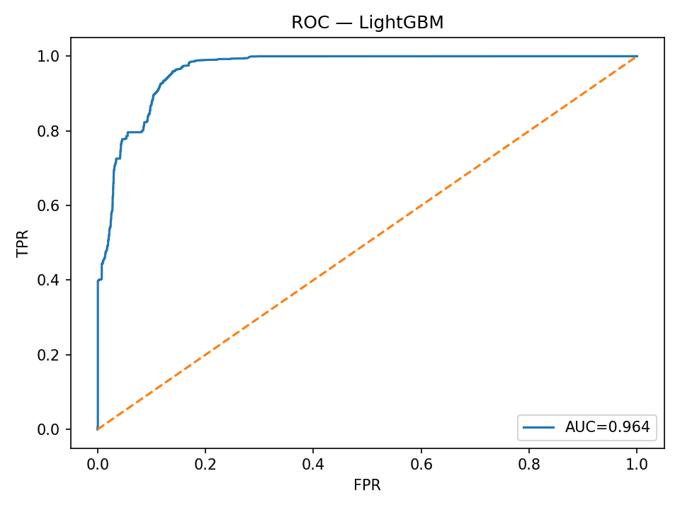
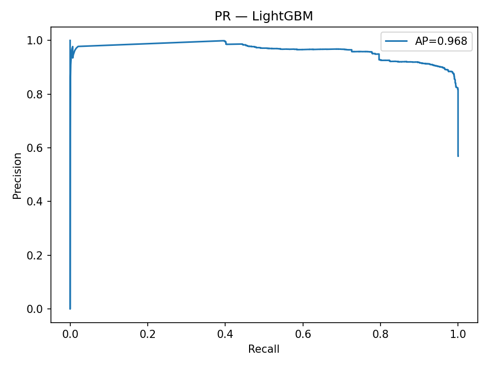
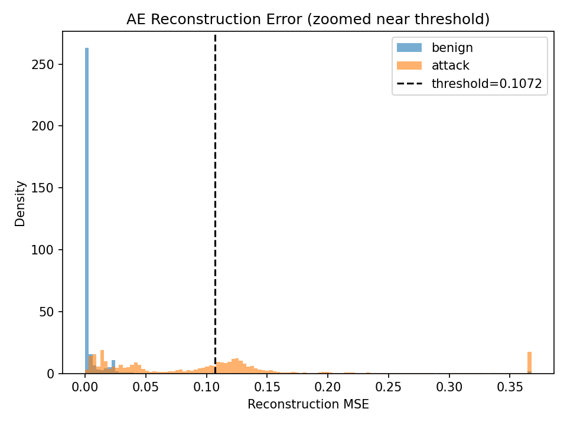

# NetShield-Model

**Network Intrusion Detection System (NIDS) on NSL-KDD**  
Combines **LightGBM** (supervised) and **Autoencoder** (unsupervised) to detect both known attacks and zero-day anomalies.  

## Project Idea  
In modern cybersecurity, intrusion detection systems (IDS) that rely solely on supervised models often fail to detect novel or zero-day attacks. To address this limitation, this project builds a hybrid pipeline that leverages both supervised and unsupervised approaches:  

- **LightGBM**: trained on labeled data, highly effective at detecting known attacks and close variants.  
- **Autoencoder (AE)**: learns the “normal shape” of network traffic and flags anomalies based on reconstruction error, making it valuable for zero-day detection.  
- **Fusion Strategy**: combines the outputs of both models using an **OR rule** to minimize false negatives — if either model flags an event, it will be marked as suspicious.
  
## Results (NSL-KDD)

**LightGBM** *(best threshold from validation: 0.2569)*

* ROC‑AUC: **0.9643**
* Average Precision (AP): **0.9677**

```
benign  P=0.6719  R=0.9711  F1=0.7943  (n=9711)
attack  P=0.9670  R=0.6412  F1=0.7711  (n=12833)
```

**Autoencoder (threshold-based)**

```
benign  P=0.5768  R=0.9857  F1=0.7277
attack  P=0.9766  R=0.4527  F1=0.6187
```

**Fusion OR (LGBM OR AE)**

```
accuracy 0.8184 | macro avg F1 ≈ 0.8183
```

### Plots

* ROC — LightGBM: 
* PR — LightGBM: 
* AE reconstruction error (zoom near threshold): 

---

## Quickstart

```bash
# 0) Put NSL-KDD files here
#    data/raw/KDDTrain+.txt
#    data/raw/KDDTest+.txt

# 1) Preprocess
python src/data/preprocess_nslkdd.py \
  --train data/raw/KDDTrain+.txt \
  --test  data/raw/KDDTest+.txt \
  --out   data/processed

# 2) Train LightGBM (with validation & best threshold)
python src/models/train_lgbm.py --data data/processed --out artifacts

# 3) Train Autoencoder on benign-only (save p99.5 threshold)
python src/models/train_autoencoder.py --data data/processed --out artifacts

# 4) Evaluate & export plots/reports
python evaluation/evaluate.py --data data/processed --artifacts artifacts --report reports

# 5) Serve API (expects already preprocessed vectors)
uvicorn src.serving.app:app --reload --port 8000
```

### API quick test

```bash
curl -X POST http://127.0.0.1:8000/predict \
  -H "Content-Type: application/json" \
  -d '{"values": [/* 122-dim processed vector */]}'
```

Response:

```json
{
  "lgbm_attack_prob": 0.99,
  "is_attack_lgbm": true,
  "ae_error": 0.12,
  "is_attack_ae": true,
  "fusion_or": true
}
```

---

## Why both models?

* **LightGBM** maximizes precision/recall on **known** classes.
* **AE** flags **unseen/zero-day** traffic via high reconstruction error.
* **Fusion OR** raises an alert if **either** model flags → better system recall.
****
---

## Repo core layout 

```
NetShield-Model/
├─ data/
│  ├─ raw/ (KDDTrain+.txt, KDDTest+.txt)
│  └─ processed/ (X_*.npy, scaler.pkl, ohe.pkl, feature_names.json)
├─ src/
│  ├─ data/preprocess_nslkdd.py
│  ├─ models/train_lgbm.py
│  ├─ models/train_autoencoder.py
│  └─ serving/app.py
├─ evaluation/evaluate.py
├─ artifacts/ (lgbm_model.pkl or lgbm.pkl, ae_model.h5, thresholds)
└─ reports/ (roc_lgbm.png, pr_lgbm.png, ae_error_dist.png, *.txt)


## Environment

* Python 3.10+
* TensorFlow **2.10** (GPU-compatible)
* LightGBM ≥ 4.x, scikit-learn, joblib, FastAPI, Uvicorn, pandas, numpy, matplotlib

Install:

```bash
pip install -r requirements.txt
```

---

